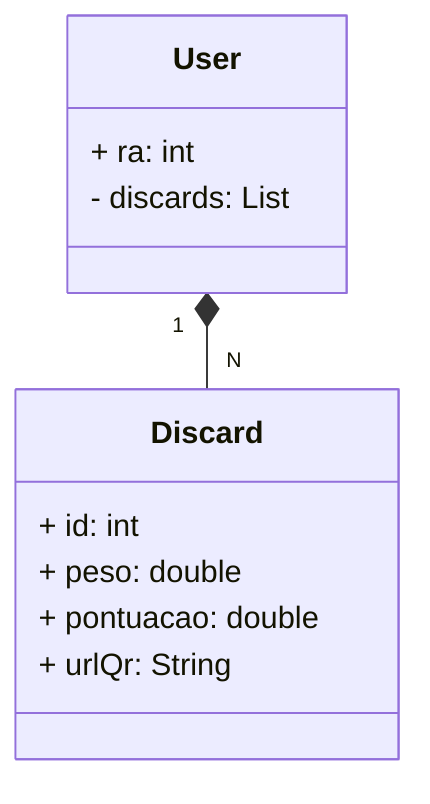

### Diagrama de classe

```mermaid
classDiagram
  class User {
    + ra: int
    - discards: List<Discard>
  }
  class Discard {
    + id: int
    + peso: double
    + pontuacao: double
    + urlQr: String
  }

  User "1" *-- "N" Discard
```
